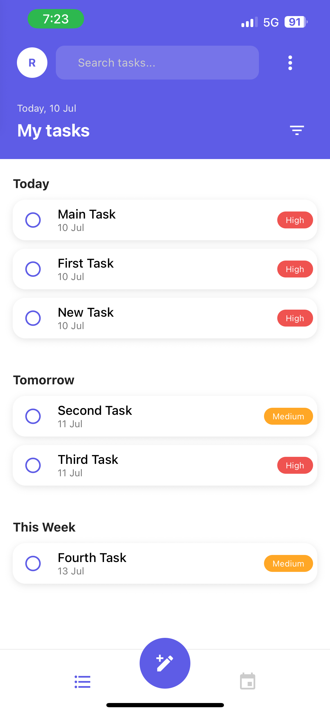
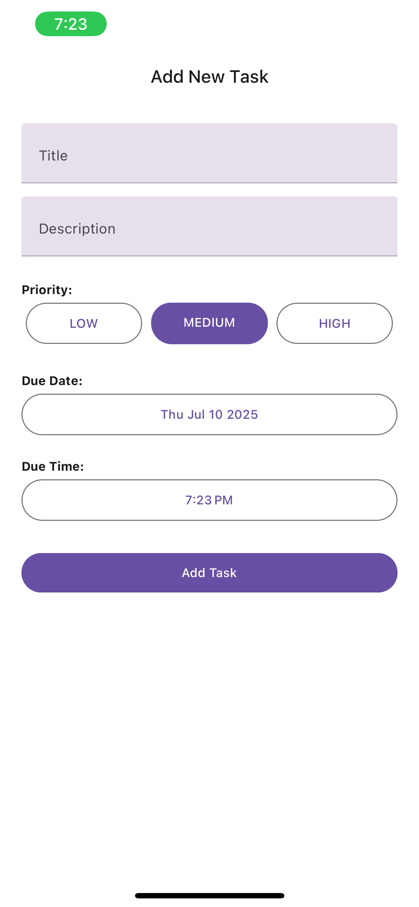
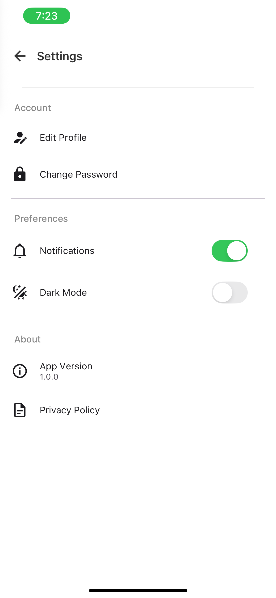
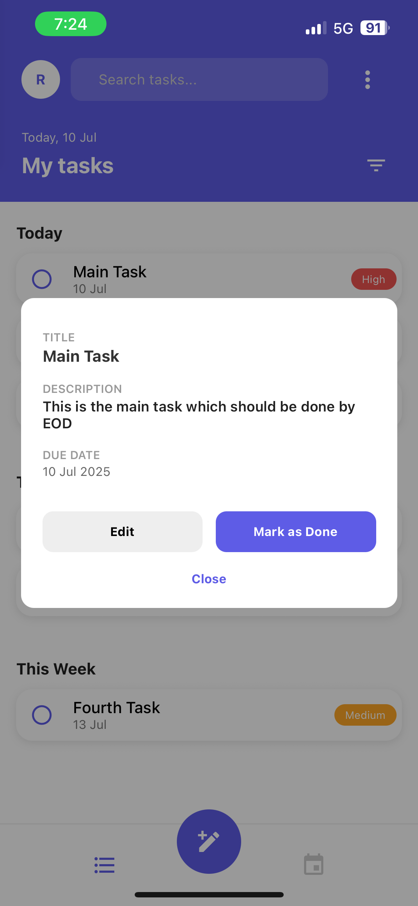
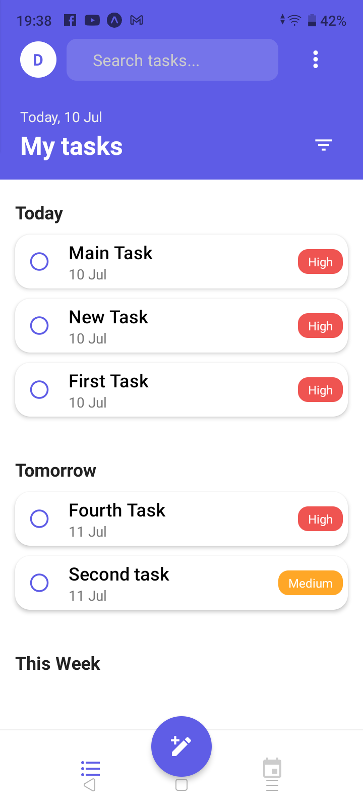
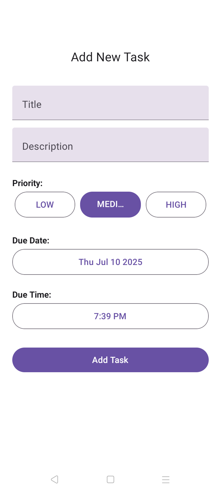
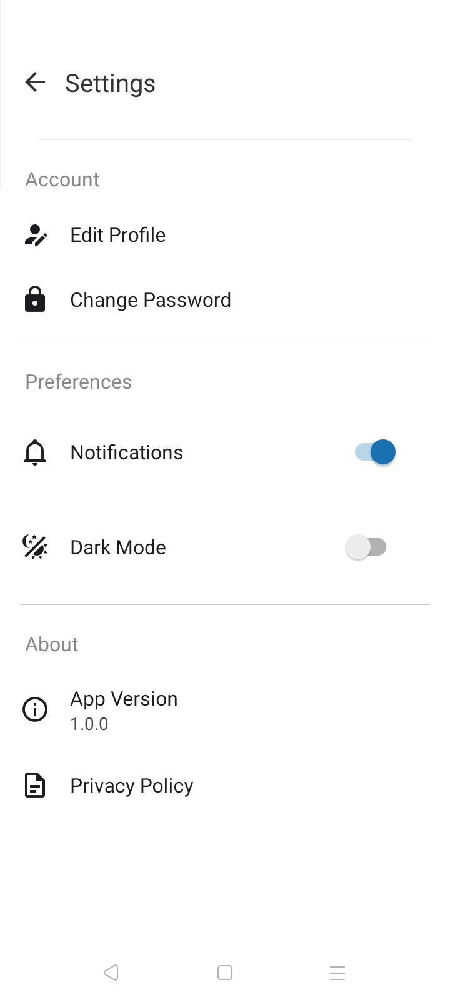
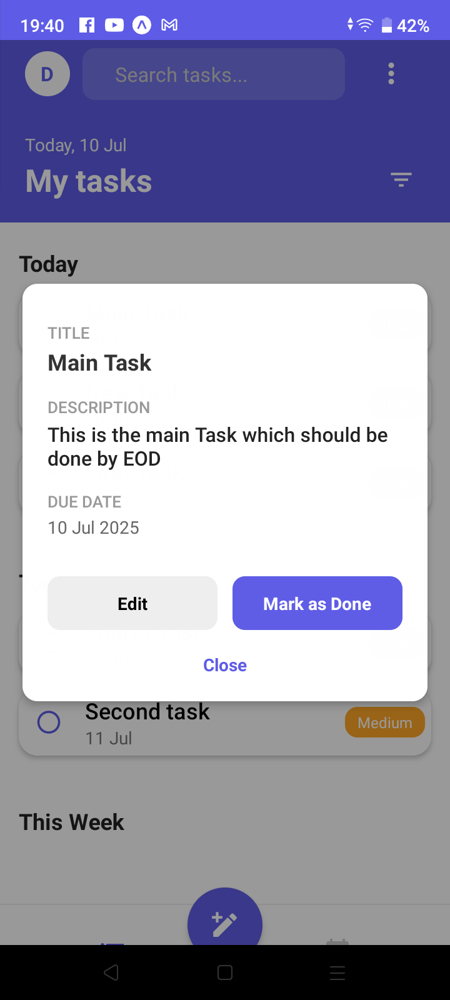

# 📋 Task Manager App (Expo)

A modern **Task Management App for Gig Workers** built using **React Native + Expo**, featuring:

- 🔐 Firebase Authentication
- ✅ Task CRUD (Create, Read, Update, Delete)
- 🗓️ Due date & priority
- 🌓 Dark Mode Toggle
- ⚙️ Settings Screen
- 🎨 Clean UI for both Android and iOS

---

## 🚀 Features

### 🔐 Authentication
- Firebase email/password login & signup
- Proper error handling for invalid credentials

### 📝 Task Management
- Add, edit, delete, view tasks
- Fields: title, description, due date/time, priority
- Mark tasks as complete/incomplete

### 🎛 Filtering & Sorting
- Filter tasks by priority and completion
- Sort by due date (earliest to latest)

### 🌙 Settings
- Notification & Dark Mode toggles
- View app version & privacy policy (placeholder)

### 💡 UI/UX
- Material Design inspired layout using `react-native-paper`
- Adaptive layout for both Android and iOS
- Status bar and SafeArea handled on both platforms

---

## 📸 Screenshots

### iOS (Expo Go)

| Task List | Add Task | Settings |
|-----------|----------|----------|
|  |  |  | |  |

### Android (Expo Go)

| Task List | Add Task | Settings |
|-----------|----------|----------|
|  |  |  | |  |

> Place screenshots inside `assets/screenshots/` folder.

---

## 🛠 Technologies Used

- ✅ **React Native (Expo)**
- 🔐 **Firebase Auth + Firestore**
- 🎨 **React Native Paper**
- 📦 **TypeScript**
- ⚙️ **React Navigation (Stack + Drawer)**

---
## 📦 Getting Started

### 1. Clone the Repository
- git clone https://github.com/your-username/task-manager-app.git
- cd task-manager-app
- npm start

### 2. Install Dependecies
- npm install

### 3. Use Expo Go Application (both iOS & Android)
- scan the QR code or enter a URL manually

🙋‍♂️ **About the Project**
This project was developed as part of a React Native Internship Assignment. The goal was to build a real-world gig-task management app with clean architecture, Firebase backend, and platform-specific UI adjustments using Expo.

📧 **Contact**
Feel free to reach out if you face issues running the app or reviewing the code!

📬 jadhaor181@gmail.com

Built with 💙 using React Native + Expo

---
